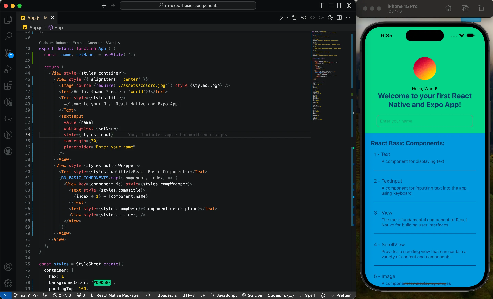

# A Hands-on Guide to Creating React Native & Expo Apps with Basic Components

Welcome, all aspiring mobile app developers! Today, we will have a delightful journey to build engaging React Native apps using its fundamental building blocks - the basic components. Buckle up, because we'll be diving deep into each one, transforming a blank canvas into a vibrant app, brick by beautiful brick.

## Table of Contents

- [Project Setup](#project-setup)
- [Laying the Foundation with View](#laying-the-foundation-with-view)
- [Speaking Volumes with Text](#speaking-volumes-with-text)
- [Showcasing the World with Image](#showcasing-the-world-with-image)
- [Style with Flair using StyleSheet](#style-with-flair-using-stylesheet)
- [User Input Symphony with TextInput](#user-input-symphony-with-textinput)
- [Endless Scrolling with ScrollView](#endless-scrolling-with-scrollview)
- [And the Adventure Continues…](#and-the-adventure-continues)

## Project Setup

Let's create a new Expo app to experiment with each component and observe their behavior. As promised, this tutorial is a hands-on guide, meaning we will learn by practicing each component.

```bash
# create a new react native and expo app named "rn-expo-basic-components"
npx create-expo-app rn-expo-basic-components

# navigate to the newly created app folder
cd rn-expo-basic-components

# run the app server
npm start

# Press "i" to open iOS simulator or
# Press "a" to open Android emulator or
# Scan the QR code to run the app on Physical devices over Expo Go
```


If you are new or having trouble with environment setup, refer to my previous blog [Building Your First Mobile App with React Native and Expo](https://medium.com/devsorigin/building-your-first-mobile-app-with-react-native-and-expo-a-comprehensive-guide-249d2a61a265)

## Laying the Foundation with View

Imagine an artist holding an empty canvas. That is what `View` is – the blank container for all our app's elements. It defines the layout and position of other components, like a sturdy frame holding the masterpiece together.

```js
import React from 'react';
import { View } from 'react-native';

export default function App() {
  return (
    <View
      style={{
        flex: 1,
        backgroundColor: '#09D588',
        alignItems: 'center',
        justifyContent: 'center',
      }}
    >
      {/* More components will be placed here! */}
    </View>
  );
}
```

The code snippet was taken from the initial codebase generated by the Expo app template. It was then modified only to display `View` components with inline styles that turn into a blank green canvas as below:


This simple code tells the View component to use a light green (#09D588) background and occupies the entire screen. Now, let's paint on this canvas!

## Speaking Volumes with Text

What’s an app without words? Enter, the Text component inside the View component to utilize the voice of our application. It displays any message you desire, from captivating titles to informative prompts.

```jsx
import React from 'react';
import { Text, View } from 'react-native';

export default function App() {
  return (
    <View
      style={{
        flex: 1,
        backgroundColor: '#09D588',
        alignItems: 'center',
        justifyContent: 'center',
      }}
    >
      <Text
        style={{
          fontSize: 24,
          fontWeight: 'bold',
          textAlign: 'center',
          paddingHorizontal: 20,
        }}
      >
        Welcome to your first React Native and Expo App!
      </Text>
    </View>
  );
}
```

We have placed the `Text` component inside `View` component and with this code, we add a bold, welcoming message to our app. Play with font sizes, styles, and colors to express your app’s personality!


## Showcasing the World with Image

A picture is worth a thousand words and `Image` brings that saying to life in your app. Showcase stunning visuals, logos, or even user-uploaded photos to add depth and engagement.

```jsx
import React from 'react';
import { Image, Text, View } from 'react-native';

export default function App() {
  return (
    <View
      style={{
        flex: 1,
        backgroundColor: '#09D588',
        alignItems: 'center',
        justifyContent: 'center',
      }}
    >
      <Image
        source={require('./assets/colors.jpg')}
        style={{ width: 75, height: 75, borderRadius: 50, marginBottom: 20 }}
      />
      <Text
        style={{
          fontSize: 24,
          fontWeight: 'bold',
          textAlign: 'center',
          paddingHorizontal: 20,
        }}
      >
        Welcome to your first React Native and Expo App!
      </Text>
    </View>
  );
}
```

Here, we display an image called “colors.jpg” with specific dimensions and styles. Let your creativity shine by incorporating dynamic images or animations!


## Style with Flair using StyleSheet

Our code has become lengthy and complex, mainly due to the use of inline styles. This not only breaks the "Don't Repeat Yourself" (DRY) principle but also makes the codebase messier and unorganized. Fortunately, React Native provides a component called `StyleSheet` that helps us to organize our styles in a better way, enabling us to reuse the same styles wherever we need them.

```jsx
import React from 'react';
import { Image, StyleSheet, Text, View } from 'react-native';

export default function App() {
  return (
    <View style={styles.container}>
      <Image source={require('./assets/colors.jpg')} style={styles.logo} />
      <Text style={styles.title}>
        Welcome to your first React Native and Expo App!
      </Text>
    </View>
  );
}

const styles = StyleSheet.create({
  container: {
    flex: 1,
    backgroundColor: '#09D588',
    alignItems: 'center',
    justifyContent: 'center',
  },
  logo: {
    width: 75,
    height: 75,
    borderRadius: 50,
    marginBottom: 20,
  },
  title: {
    fontSize: 24,
    color: '#063768',
    fontWeight: 'bold',
    textAlign: 'center',
    paddingHorizontal: 20,
  },
});
```

Here, we use the `StyleSheet` component to re-organize our app's codebase. but the output remains the same.


We only changed the `Text` color from **black** to a shade of blue **(#063768)** to better visualize the fonts with the current background.

## User Input Symphony with TextInput

Give your users a voice with `TextInput`. This versatile component allows users to type, search, and interact with your app, making it truly dynamic.

```jsx
import React, { useState } from 'react';
import { Image, StyleSheet, Text, TextInput, View } from 'react-native';

export default function App() {
  const [name, setName] = useState('');

  return (
    <View style={styles.container}>
      <Image source={require('./assets/colors.jpg')} style={styles.logo} />
      <Text>Hello, {name ? name : 'World'}!</Text>
      <Text style={styles.title}>
        Welcome to your first React Native and Expo App!
      </Text>
      <TextInput
        value={name}
        onChangeText={setName}
        style={styles.input}
        maxLength={30}
        placeholder="Enter your name"
      />
    </View>
  );
}

const styles = StyleSheet.create({
  container: {
    flex: 1,
    backgroundColor: '#09D588',
    alignItems: 'center',
    justifyContent: 'center',
  },
  logo: {
    width: 75,
    height: 75,
    borderRadius: 50,
    marginBottom: 20,
  },
  title: {
    fontSize: 24,
    color: '#063768',
    fontWeight: 'bold',
    textAlign: 'center',
    paddingHorizontal: 20,
  },
  input: {
    height: 40,
    width: '80%',
    borderColor: 'gray',
    borderWidth: 1,
    borderRadius: 10,
    paddingHorizontal: 10,
    marginVertical: 20,
    color: '#063768',
  },
});
```

This code creates an input field where users can enter their name and store it in a variable called **“name”**. Now, you can personalize the app based on user input!


We have added a `TextInput` component to collect user input and save it in a variable using a React `useState` hook. The input value is displayed above the previous `Text` component.

## Endless Scrolling with ScrollView

Sometimes, your app’s content overflows the screen. That’s where `ScrollView` comes in, enabling smooth scrolling through endless content, from long lists to detailed articles.

First, add some content before adding `ScrollView` to understand the problem:

```jsx
import React, { useState } from 'react';
import { Image, StyleSheet, Text, TextInput, View } from 'react-native';

const RN_BASIC_COMPONENTS = [
  {
    id: '1',
    name: 'Text',
    description: 'A component for displaying text',
  },
  {
    id: '2',
    name: 'TextInput',
    description: 'A component for inputting text into the app using keyboard',
  },
  {
    id: '3',
    name: 'View',
    description:
      'The most fundamental component of React Native for building user interfaces',
  },
  {
    id: '4',
    name: 'ScrollView',
    description:
      'Provides a scrolling view that can contain a variety of content and components',
  },
  {
    id: '5',
    name: 'Image',
    description: 'A component for displaying images',
  },
  {
    id: '6',
    name: 'StyleSheet',
    description: 'Provides an abstraction layer similar to CSS stylesheets',
  },
];

export default function App() {
  const [name, setName] = useState('');

  return (
    <View style={styles.container}>
      <View style={{ alignItems: 'center' }}>
        <Image source={require('./assets/colors.jpg')} style={styles.logo} />
        <Text>Hello, {name ? name : 'World'}!</Text>
        <Text style={styles.title}>
          Welcome to your first React Native and Expo App!
        </Text>
        <TextInput
          value={name}
          onChangeText={setName}
          style={styles.input}
          maxLength={30}
          placeholder="Enter your name"
        />
      </View>
      <View style={styles.bottomWrapper}>
        <Text style={styles.subtitle}>React Basic Components:</Text>
        {RN_BASIC_COMPONENTS.map((component, index) => (
          <View key={component.id} style={styles.compWrapper}>
            <Text style={styles.compTitle}>
              {index + 1} - {component.name}
            </Text>
            <Text style={styles.compDesc}>{component.description}</Text>
            <View style={styles.divider} />
          </View>
        ))}
      </View>
    </View>
  );
}

const styles = StyleSheet.create({
  container: {
    flex: 1,
    backgroundColor: '#09D588',
    paddingTop: 100,
  },
  logo: {
    width: 75,
    height: 75,
    borderRadius: 50,
    marginBottom: 20,
  },
  title: {
    fontSize: 24,
    color: '#063768',
    fontWeight: 'bold',
    textAlign: 'center',
    paddingHorizontal: 20,
  },
  input: {
    height: 40,
    width: '80%',
    borderColor: 'gray',
    borderWidth: 1,
    borderRadius: 10,
    paddingHorizontal: 10,
    marginVertical: 20,
    color: '#063768',
  },
  subtitle: {
    fontSize: 20,
    color: '#063768',
    fontWeight: 'bold',
  },
  bottomWrapper: {
    padding: 20,
    backgroundColor: '#09D',
  },
  compWrapper: {
    padding: 10,
  },
  compTitle: {
    fontSize: 16,
    color: '#063768',
    paddingVertical: 5,
  },
  compDesc: {
    fontSize: 14,
    color: '#063768',
  },
  divider: {
    width: '100%',
    height: 1,
    marginTop: 20,
    backgroundColor: '#063768',
  },
});
```

In this code, we have added an array called `RN_BASIC_COMPONENTS` that holds a list of information about each React Native basic component and later we incorporate that array to display them as below:



Our content exceeds the screen size, making it impossible to view. Let's add a `ScrollView` component to fix the issue.

```jsx
import React, { useState } from 'react';
import {
  Image,
  ScrollView,
  StyleSheet,
  Text,
  TextInput,
  View,
} from 'react-native';

const RN_BASIC_COMPONENTS = [
  {
    id: '1',
    name: 'Text',
    description: 'A component for displaying text',
  },
  {
    id: '2',
    name: 'TextInput',
    description: 'A component for inputting text into the app using keyboard',
  },
  {
    id: '3',
    name: 'View',
    description:
      'The most fundamental component of React Native for building user interfaces',
  },
  {
    id: '4',
    name: 'ScrollView',
    description:
      'Provides a scrolling view that can contain a variety of content and components',
  },
  {
    id: '5',
    name: 'Image',
    description: 'A component for displaying images',
  },
  {
    id: '6',
    name: 'StyleSheet',
    description: 'Provides an abstraction layer similar to CSS stylesheets',
  },
];

export default function App() {
  const [name, setName] = useState('');

  return (
    <ScrollView style={styles.container}>
      <View style={{ alignItems: 'center' }}>
        <Image source={require('./assets/colors.jpg')} style={styles.logo} />
        <Text>Hello, {name ? name : 'World'}!</Text>
        <Text style={styles.title}>
          Welcome to your first React Native and Expo App!
        </Text>
        <TextInput
          value={name}
          onChangeText={setName}
          style={styles.input}
          maxLength={30}
          placeholder="Enter your name"
        />
      </View>
      <View style={styles.bottomWrapper}>
        <Text style={styles.subtitle}>React Basic Components:</Text>
        {RN_BASIC_COMPONENTS.map((component, index) => (
          <View key={component.id} style={styles.compWrapper}>
            <Text style={styles.compTitle}>
              {index + 1} - {component.name}
            </Text>
            <Text style={styles.compDesc}>{component.description}</Text>
            <View style={styles.divider} />
          </View>
        ))}
      </View>
    </ScrollView>
  );
}

const styles = StyleSheet.create({
  container: {
    flex: 1,
    backgroundColor: '#09D588',
    paddingTop: 100,
  },
  logo: {
    width: 75,
    height: 75,
    borderRadius: 50,
    marginBottom: 20,
  },
  title: {
    fontSize: 24,
    color: '#063768',
    fontWeight: 'bold',
    textAlign: 'center',
    paddingHorizontal: 20,
  },
  input: {
    height: 40,
    width: '80%',
    borderColor: 'gray',
    borderWidth: 1,
    borderRadius: 10,
    paddingHorizontal: 10,
    marginVertical: 20,
    color: '#063768',
  },
  subtitle: {
    fontSize: 20,
    color: '#063768',
    fontWeight: 'bold',
  },
  bottomWrapper: {
    padding: 20,
    backgroundColor: '#09D',
    marginBottom: 100,
  },
  compWrapper: {
    padding: 10,
  },
  compTitle: {
    fontSize: 16,
    color: '#063768',
    paddingVertical: 5,
  },
  compDesc: {
    fontSize: 14,
    color: '#063768',
    paddingLeft: 25,
  },
  divider: {
    width: '100%',
    height: 1,
    marginTop: 20,
    backgroundColor: '#063768',
  },
});
```

Here we go, our screen is now fully scrollable 🚀


## And the Adventure Continues…

This is just the beginning of your React Native journey! With these basic components as your building blocks, you can create stunning, interactive mobile apps that captivate users. Go forth, experiment, and unleash your creativity — the world of React Native awaits!

Thanks for Reading and your contribution is most welcome. Feel free to share your thoughts by opening an [issue](https://github.com/jaamaalxyz/rn-expo-basic-components/issues/new), starting a [discussion](https://github.com/jaamaalxyz/rn-expo-basic-components/discussions), or [sending a PR](https://github.com/jaamaalxyz/rn-expo-basic-components/pulls). I'd love to hear your feedback.
